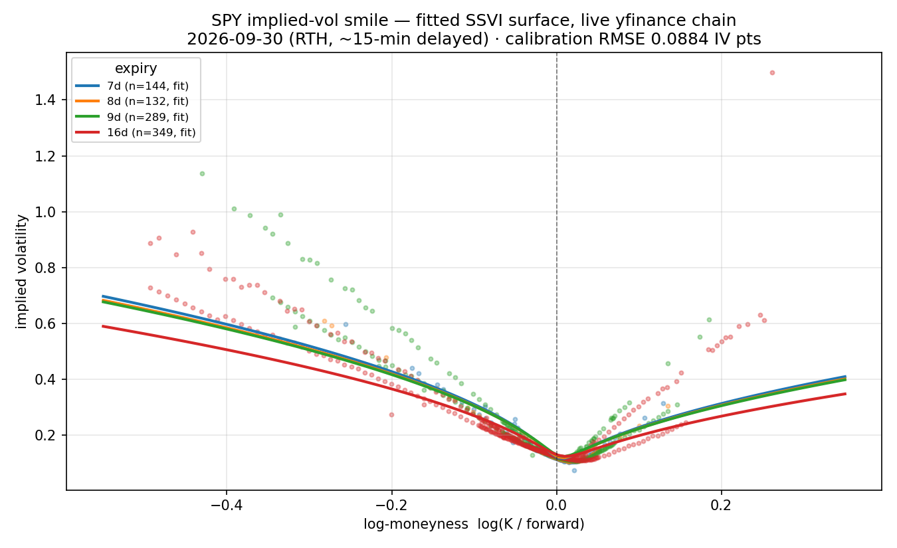

# snowball-pricer

Real-time implied-volatility-surface-driven **basket snowball / autocallable pricer** via Monte Carlo.

Standalone project, independent from [Legos](https://github.com/faketut/legos): Legos optimizes
latency (ns tick-to-trade); this optimizes pricing accuracy (ms–s Monte Carlo throughput).
Shared discipline, not code — Spec-Driven Development, `SPEC.md` first.

## Data feeds

| Feed | Latency | Cost | Flag |
|---|---|---|---|
| yfinance (default) | ~15 min delayed | free | `--feed yfinance` |
| Questrade | real-time L1 | $9.95 CAD/mo | `--feed questrade` |

yfinance is the default validation feed (`is_delayed=True` hardcoded); Questrade is an
optional upgrade (needs a refresh token + market-data subscription — see
`docs/questrade_setup.md`). The feed contract lives in `snowball_pricer/tick.py`.

## Visualization



SPY implied-vol smile from a live yfinance chain (RTH, ~15-min delayed), fitted with the
P1 SSVI pipeline. Interactive version with the 3D surface, measured price sensitivities,
and the P4 P&L-explain waterfall: [`docs/demo.html`](docs/demo.html).

## Error budget

| | Source | Target |
|---|---|---|
| ε_num | MC sampling error | < 0.1% of notional |
| ε_stale | stale input (intraday IV moves) | < 0.3% |
| ε_model | model vs dealer quotes | < 2% |

See `docs/error_budget.md`. The honest claim of this project is shrinking **ε_stale**
(live surface vs yesterday's close).

## Quickstart

```bash
pip install -r requirements.txt
pytest                                          # full suite, green
python3 scripts/live_loop.py --feed yfinance --underlyings SPY
```

## Layout

```text
SPEC.md                  product mechanics, data contracts, error budget
snowball_pricer/         pipeline: tick -> IV -> SSVI surface -> snapshot
  pricing/               Dupire local-vol MC engine, Greeks
  feeds/                 yfinance (delayed) / questrade adapters
scripts/live_loop.py     live loop with monitoring
docs/                    error_budget, setup guides, phase reports
```
